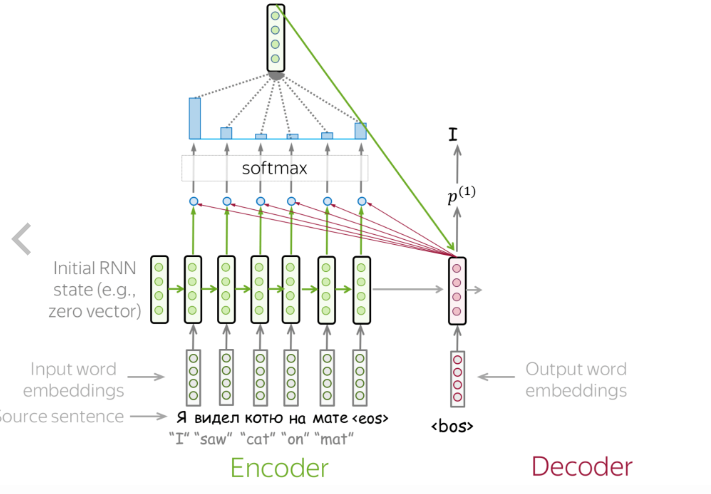
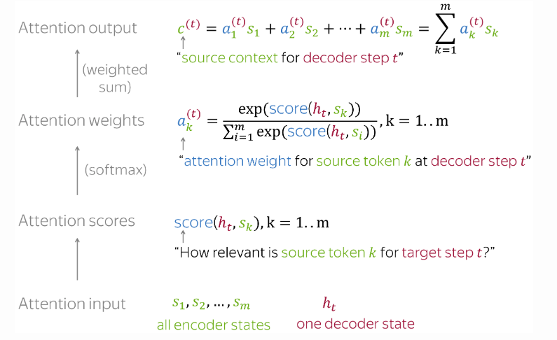

## Proposed Solution

### Solution

`Note` : To explain we suppose the seq2seq model is a sentence translator.
All argues below are the same for any kind of sequence

To mitigate the bottleneck in the Seq2Seq architecture, we can use an attention mechanism. The attention mechanism allows the decoder to focus on different parts of the source sentence at each step of the decoding process, rather than relying on a single fixed-size context vector. This way, the model can dynamically access relevant information from the entire source sentence, improving the seq2seq model quality for longer and more complex sentences.


The image below show how we can calculate the context vector using attention mechanism



### Optional Pseudo-Code

```python

# Encoder
encoder_outputs, hidden = encoder(source_sentence)

# Initialize the decoder's hidden state with the encoder's final hidden state
decoder_hidden = hidden

# Initialize the attention weights
attention_weights = []

# Decoder
for t in range(target_sentence_length):
    # Compute attention scores
    attention_scores = compute_attention_scores(decoder_hidden, encoder_outputs)
    
    # Compute attention weights
    attention_weights_t = softmax(attention_scores)
    attention_weights.append(attention_weights_t)
    
    # Compute the context vector as the weighted sum of encoder outputs
    context_vector = sum(attention_weights_t * encoder_outputs)
    
    # Concatenate the context vector with the decoder's input
    decoder_input = concatenate(context_vector, target_sentence[t])
    
    # Generate the next word and update the decoder's hidden state
    output, decoder_hidden = decoder(decoder_input, decoder_hidden)
```
